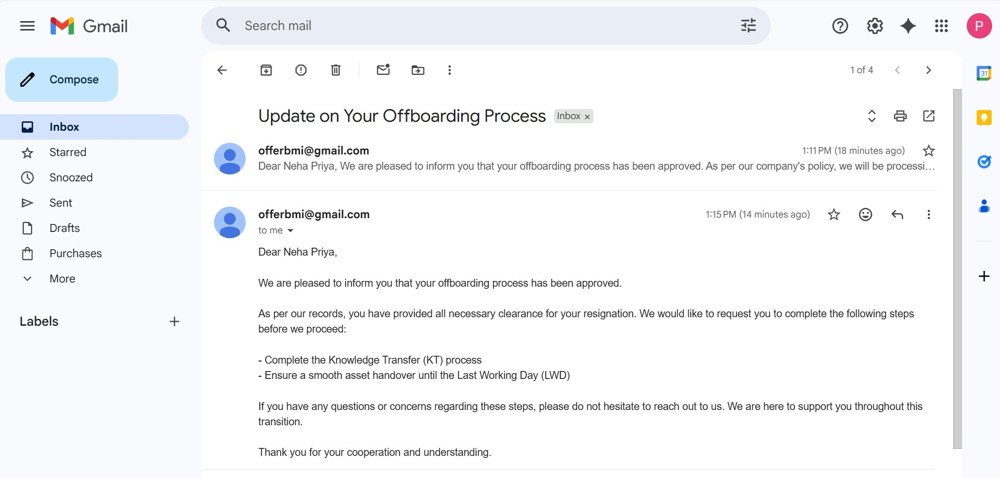
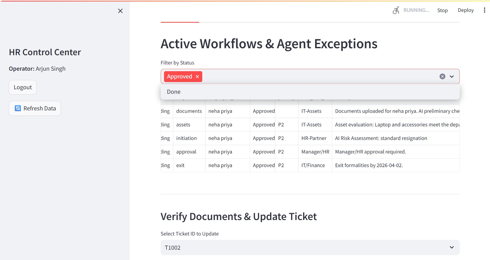

# Multi-Agent Onboarding & Offboarding System
**Python · LangGraph · FastAPI · Azure/OpenAI/Llama · LangSmith · Streamlit**

An intelligent, agent-driven Onboarding/offboarding platform built with **LangGraph**, **FastAPI**, and **Streamlit**. This system utilizes a Hub-and-Spoke Micro-Orchestration architecture to automate candidate onboarding and employee offboarding, seamlessly blending autonomous LLM reasoning with mandatory Human-In-The-Loop (HITL) checkpoints and sandboxed Model Context Protocol (MCP) side-effects.
---

## Key Features & Engineering Patterns

* **State-Driven Orchestration (LangGraph):** Manages asynchronous workflow steps (Offer → Documents → Assets) natively, pushing tasks to `END` states to safely await human inputs without race conditions.
* **Strict Security Boundaries (MCP):** The main AI agents have no direct network or disk write access. All side effects (e.g., SMTP emails, local filesystems) are securely routed through isolated Model Context Protocol (MCP) subprocesses.
* **Idempotent Data Operations:** Custom `_upsert_ticket` logic ensures that re-running a workflow node safely updates state rather than duplicating database records.
* **Dynamic Structured Outputs:** Uses Pydantic schemas to force the LLM to generate strictly formatted notification emails based on dynamic HR ticket statuses and comments.
* **Context-Aware Chatbot:** A strictly bounded React agent equipped with dynamic prompt-injection. It knows the user's current exact flow state and aggressively refuses out-of-bounds questions to prevent prompt-injection jailbreaks.

---


---
## Scalable high level system design for Agentic Onboarding/Offboarding

###  HLSD : End‑to‑End Agentic Onboarding/Offboarding Flow

[]()

---

## LangGraph Agent Orchestration and Node Flow

### Node flow of agents and Tool usages

[]()

---

## Gmail Integraion with system

### Agentic email notification

[]()

---

## HR Control Center (Human In The Loop)

### HR control Center for HITL (Human In The Loop)

[]()

---

## Demo Videos

### ▶ Video 1: End‑to‑End Onboarding Process

[](https://drive.google.com/file/d/1OZAnNpU-O9d2DnWT17erlOOSs2TT9dQF/view?usp=sharing)

---

### ▶ Video 2: End to End Offboarding Process

[](https://drive.google.com/file/d/1rwXpsi-5ph4d-jC5F3jbbgYdFoRaCSkr/view?usp=sharing)


## Scope & Capabilities

This platform is designed to handle the end-to-end employee lifecycle, replacing scattered email chains with a centralized, predictable state machine. 

### What It Covers (The Employee Lifecycle)
* **Pre-boarding:** Manages offer letter resolution, background check initiation, and early candidate engagement.
* **Compliance & Administration:** Securely collects, parses, and validates government IDs (e.g., Aadhar, PAN), tax forms, and NDAs.
* **IT Provisioning:** Evaluates department-specific rules to automate hardware allocation, software licensing, and access provisioning.
* **Offboarding & Separation:** Handles resignation initiation, AI-driven risk assessment, exit interviews, and IT asset revocation.

### How It Operates (Under the Hood)
* **State-Driven Workflows:** Uses LangGraph to enforce strict prerequisites (e.g., an employee cannot request IT assets until their identity documents are approved).
* **Role-Based Portals:** Provides a gamified, step-by-step checklist UI for candidates, while giving HR an administrative dashboard to monitor bottlenecks and override AI decisions.
* **Agentic AI Validation:** Replaces manual HR data entry by using Vision LLMs and native tools to autonomously extract data from PDFs and validate company policies.
* **Automated Event Triggers:** Uses FastAPI background tasks to listen for state changes and dispatch dynamic, LLM-drafted email notifications via secure MCP subprocesses.
* **Extensible Integrations:** The modular Hub-and-Spoke design makes it trivial to connect external third-party APIs (e.g., DocuSign, Okta/SSO, Jira) as the system scales.

##  Project Structure

```
customer-support-agent/
├── backend/
│   ├── retriver           # RAG
│   ├── agents.py          # LangGraph agents, native tools, and Pydantic schemas
│   ├── graph.py           # LangGraph state machine and routing logic
│   ├── server.py          # FastAPI gateway, background tasks, and endpoints
│   ├── tickets.py         # Idempotent CSV database operations
│   └── mcp_client.py      # Async Model Context Protocol client
├── frontend/
│   ├── app_onboarding.py  # Streamlit UI for new hires
│   ├── app_offboarding.py # Streamlit UI for exiting employees
│   └── app_hr.py          # Streamlit UI for HR Administrators
├── servers/
│   ├── email_server.py    # MCP Subprocess: Gmail SMTP integration
│   └── fs_server.py       # MCP Subprocess: Sandboxed filesystem operations
├── data/                  # Local storage for CSVs and JSONL logs
├── uploads/               # Temporary native binary storage for PDFs/Images
├── src/                   # Repo demo related files
├── requirements.txt       # Project dependencies
└── README.md              # Documentation
```

---

##  Observability with LangSmith

This project is fully instrumented with **LangSmith**. You can inspect:
- Node‑level execution
- Tool inputs & outputs
- Token usage & latency
- Errors & fallbacks
- Multi‑turn threads by `session_id`


## ▶ Running the Project

### Step 1:  Install Dependencies
```bash
pip install -r requirements.txt
```

### Step 2: Configure Environment
Create a `.env` at repo root:
```env
# Locally Hosted LLM
OLLAMA_MODEL=llama3.2

# LangSmith Tracing for Agent Debugging
LANGCHAIN_TRACING_V2=true
LANGCHAIN_ENDPOINT=[https://api.smith.langchain.com](https://api.smith.langchain.com)
LANGCHAIN_API_KEY=your_langsmith_api_key_here
LANGCHAIN_PROJECT=hr-multi-agent-system

# Server
SMTP_HOST=smtp.gmail.com
SMTP_PORT=587
SMTP_USER=your-hr-bot-email@gmail.com
SMTP_PASSWORD=your_16_character_app_password
SMTP_STARTTLS=true
SMTP_FROM=your-hr-bot-email@gmail.com

FS_ALLOWED_DIRS=./uploads,./data
MCP_TICKET_MIRROR=data/tickets_mirror.jsonl

```

### Step 3: Start Server
```bash
uvicorn backend.server:app --reload --port 8000
```

### Step 4: Start CLI
```bash
streamlit run frontend/app_onboarding.py --server.port 8501
streamlit run frontend/app_offboarding.py --server.port 8502
streamlit run frontend/app_hr.py --server.port 8503
```

---

##  Author

**Tanup Vats**  
